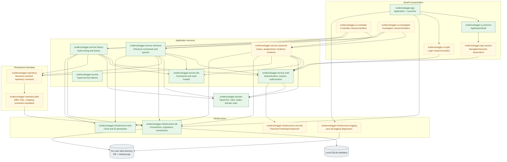

# EvidenceLogger architecture

This document describes the current implementation and the intended architecture approved in `specs/architecture.md`, `specs/product.md`, and `specs/domain-rules.md`. The repository is currently a scaffold: the solid boxes in the diagram exist in `src`; dashed boxes are planned package responsibilities with no concrete implementation yet.

## Architecture diagram

Legend: green solid nodes are represented by concrete source files today; amber dashed nodes are package-level responsibilities specified but not yet implemented. The diagram shows intended dependency direction, not a claim that every edge is currently wired.

## Package responsibilities

| Package | Current contents | Intended responsibility and boundary |
| --- | --- | --- |
| `evidencelogger.app` | `EvidenceLoggerApplication`, `EvidenceLoggerLauncher` | JavaFX lifecycle, object-graph composition, startup/shutdown, application-data path, migrations, and executor ownership. It must not contain workflow rules or SQL. |
| `evidencelogger.app.session` | Package marker only | Observe authentication state and drive role navigation. It must not decide case access or accept a UI-supplied actor identity. |
| `evidencelogger.ui.common` | `ApplicationShell` | Shared code-built controls, async task support, validation display, navigation shell, and user-readable error presentation. It must not authorize or mutate domain state. |
| `evidencelogger.ui.login` | Package marker only | Sign-in view/controller using service contracts; no direct database access. |
| `evidencelogger.ui.custodian` | Package marker only | Custodian workflows: cases, assignments, locations, registration, request decisions, handoffs, returns, and history. It delegates rules to services. |
| `evidencelogger.ui.investigator` | Package marker only | Assigned-case search, requests, acknowledgment, notes, returns, and history. UI filtering is not the security boundary. |
| `evidencelogger.service` | `ServiceException` | Persistence-neutral failures translated to readable UI messages: unauthenticated, forbidden, validation, invalid transition, conflict, not found, and storage failure. |
| `evidencelogger.service.auth` | Session and authorization contracts/value record | Authentication, password verification coordination, service-owned session issuance, role checks, and current-assignment checks. |
| `evidencelogger.service.casework` | Package marker only | Case creation, assignments, storage locations, evidence registration, and authorized case/evidence queries. |
| `evidencelogger.service.checkout` | Command/query interfaces | Request, decision, handoff, acknowledgment, note, return, inspection, and correction use cases. Implementations own use-case coordination, not JDBC transaction mechanics. |
| `evidencelogger.service.history` | Audit draft and append writer contract | Authorized ordered history and append-only corrections; audit writes use the caller-owned transaction connection. |
| `evidencelogger.service.dto` | Checkout command records and read models | Immutable, technology-neutral inputs/outputs between UI and services. No JavaFX or JDBC types. |
| `evidencelogger.domain` | Typed IDs, role/state enums | Persistence/UI-independent values and state rules for request and custody transitions. |
| `evidencelogger.repository` | Package marker only | Narrow, business-oriented persistence contracts. No authorization or generic CRUD surface. |
| `evidencelogger.repository.jdbc` | Package marker only | Prepared SQL, row mapping, conditional updates/inserts, and SQLite constraint translation. It must not commit or roll back. |
| `evidencelogger.infrastructure.db` | `TransactionRunner` contract | Connection factory, SQLite pragmas, migrations, and transaction boundaries. One service command equals one transaction. |
| `evidencelogger.infrastructure.security` | Package marker only | JDK-based salted password hashing and secure comparison; no credential logging. |
| `evidencelogger.infrastructure.logging` | Package marker only | Safe rotating diagnostic logs. These are separate from permanent append-only domain audit history. |
| `evidencelogger.infrastructure.time` | `IdGenerator` contract | Injectable clock and ID generation for production and deterministic tests; it does not decide domain outcomes. |

## Key architectural rules

- Dependencies point inward: UI → services → domain/repository contracts → JDBC/infrastructure → SQLite.
- Services enforce role and current assignment on direct calls; role-specific UI visibility is only presentation.
- Controllers pass typed command data. The service obtains actor, role, current state, and time from its session/database/infrastructure dependencies.
- Each successful custody change and its audit event(s) commit atomically. History and corrections are append-only.
- Approval does not check evidence out; handoff plus Investigator acknowledgment does. Custodian inspection is required before a return becomes available in storage.
- Attachments, backup/restore, case closure, release from hold, account administration, and other deferred features have no package or database component in the MVP.

## Current implementation status

Implemented today: JavaFX launcher/lifecycle, placeholder shell, typed domain identifiers/enums, checkout command/query contracts, DTO validation/read models, session/authorization contracts, typed service exceptions, audit draft/writer contracts, transaction runner contract, and ID-generator contract.

Not implemented today: concrete authentication, casework and checkout services, repository interfaces/implementations, SQLite connection/migrations/schema resources, password hashing, logging configuration, role/login controllers, and the actual Custodian/Investigator screens. Consequently, the running application currently shows the placeholder shell rather than the complete workflow described by the specifications.
